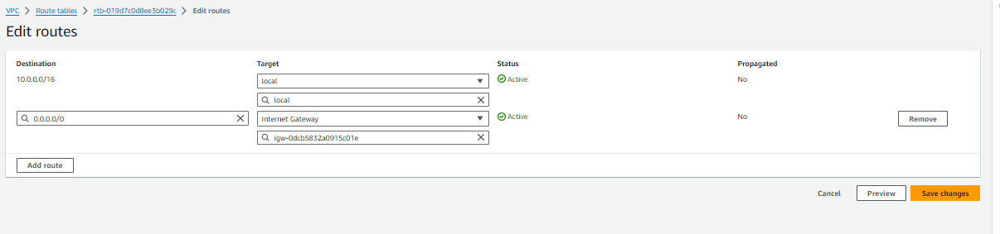
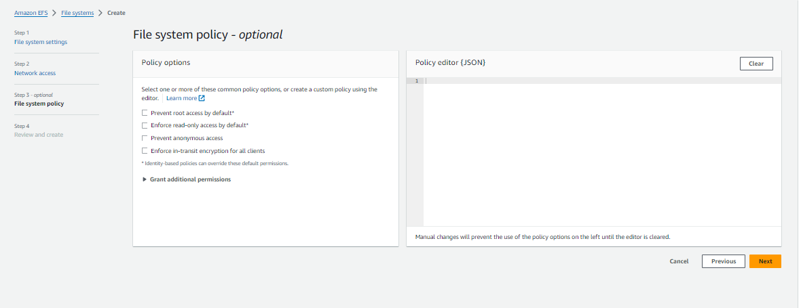
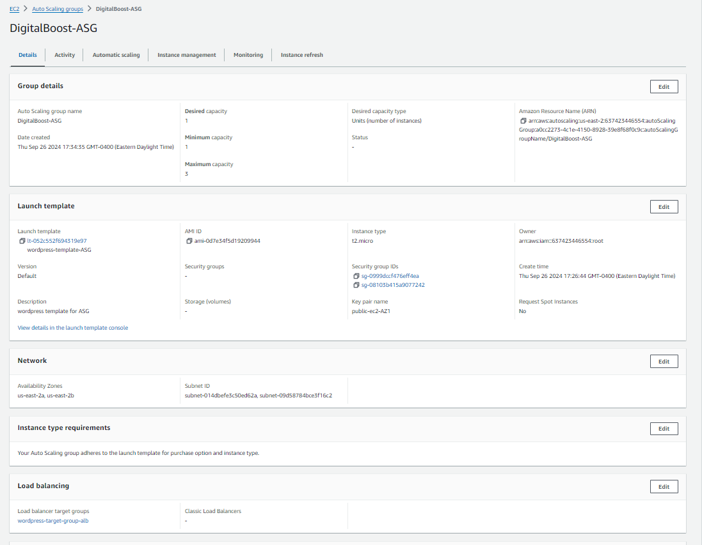

# DIGITAL BOOST WEBSITE

## Table of Contents
- [DIGITAL BOOST WEBSITE](#digital-boost-website)
  - [Table of Contents](#table-of-contents)
  - [Project Overview](#project-overview)
  - [VPC Setup](#vpc-setup)
  - [VPC and EC2 Instance Security Group rules configured](#vpc-and-ec2-instance-security-group-rules-configured)
    - [1. IP Address Range Definition](#1-ip-address-range-definition)
    - [2. Steps to Create VPC](#2-steps-to-create-vpc)
    - [3. Create Public and Private Subnet with NAT Gateway](#3-create-public-and-private-subnet-with-nat-gateway)
      - [3.1 Steps to Create Public Subnet](#31-steps-to-create-public-subnet)
      - [3.2 Steps to Create Private Subnet](#32-steps-to-create-private-subnet)
      - [3.3 Subnet and NAT Gateway Setup](#33-subnet-and-nat-gateway-setup)
      - [NAT Gateway Security Group Rules configured:](#nat-gateway-security-group-rules-configured)
      - [3.4 Steps to Create NAT Gateway](#34-steps-to-create-nat-gateway)
    - [4. Create Internet Gateway](#4-create-internet-gateway)
    - [5. Route Table Configuration](#5-route-table-configuration)
    - [6. Creating private route tables.](#6-creating-private-route-tables)
  - [AWS MySQL RDS Setup](#aws-mysql-rds-setup)
    - [RDS security group rules configured](#rds-security-group-rules-configured)
    - [Steps to Create RDS Instance](#steps-to-create-rds-instance)
    - [Steps to create DB subnet group](#steps-to-create-db-subnet-group)
    - [Steps to Configure RDS Security Groups](#steps-to-configure-rds-security-groups)
  - [EFS Setup for WordPress Files](#efs-setup-for-wordpress-files)
    - [EFS Security group Rules configured](#efs-security-group-rules-configured)
    - [Steps to Create EFS](#steps-to-create-efs)
    - [Steps to Mount EFS on EC2](#steps-to-mount-efs-on-ec2)
  - [Steps to Connect WordPress to RDS](#steps-to-connect-wordpress-to-rds)
  - [Application Load Balancer and Auto Scaling](#application-load-balancer-and-auto-scaling)
    - [ALB Security Group Rules Configured](#alb-security-group-rules-configured)
    - [Steps to Create ALB](#steps-to-create-alb)
    - [Steps to Configure ALB Listener Rules](#steps-to-configure-alb-listener-rules)
    - [Steps to Integrate ALB with Auto Scaling](#steps-to-integrate-alb-with-auto-scaling)
  - [HOW I GOT MY WORDPRESS TO DISPLAY FROM PUBLIC IP USING PUBLIC EC2 INSTANCE](#how-i-got-my-wordpress-to-display-from-public-ip-using-public-ec2-instance)
  - [TROUBLESHOOTING](#troubleshooting)
  - [Conclusion](#conclusion)


---

## Project Overview

This project involves creating a highly scalable WordPress website on AWS for a digital marketing agency, "DigitalBoost." The infrastructure includes a VPC, subnets, NAT gateways, MySQL RDS, EFS, ALB, and Auto Scaling groups to ensure high availability and fault tolerance.

---

## VPC Setup
 for further explaination on how to go about creating VPC, SUBNETS, ROUTE TABLE, NAT gateways and InternetGateways,please see the video link below: 
https://youtu.be/43tIX7901Gs?si=G8AHTUEJjxuPByie

## VPC and EC2 Instance Security Group rules configured
1. Inbound Rules:
  - Type: HTTP (80)
    Source: ALB Security Group
  - Type: HTTPS (443)
    Source: ALB Security Group
  - Type: SSH (22)
    Source: (My public ec2 instance security group)

2. Outbound Rules:
  - Type: All traffic
    Destination: 0.0.0.0/0 (Anywhere-IPv4)

### 1. IP Address Range Definition

We define the VPC with a CIDR block of 10.0.0.0/16.

**VPC creation Image: VPC CIDR Block Creation**  


### 2. Steps to Create VPC
1. In the AWS Management Console, search for **VPC**.
2. Click on **Create VPC**.
3. Enter the Name Tag for the VPC (e.g., `wordpress-vpc`).
4. Specify the IPv4 CIDR block as `10.0.0.0/16`.
5. Leave the IPv6 CIDR block as default (no IPv6).
6. Set **Tenancy** to default.
7. Click on **Create**.


### 3. Create Public and Private Subnet with NAT Gateway 
for this project, i have created 6 subnets in total, 3 subnets( 1 public and 2 private) each in two different availabity zones,
zones: 
i. us-east-2a
ii. us-east-2b

#### 3.1 Steps to Create Public Subnet
1. Go to the **Subnets** section in the VPC dashboard.
2. Click **Create Subnet**.
3. Enter the Name Tag (e.g., `public-subnet-AZ1`).
4. Select the VPC created earlier.(E.g., `Dev-VPC`)
5. Set the IPv4 CIDR Block to `10.0.0.0/24`.
6. Click **Create Subnet**.
7. Modify the subnet and enable auto-assign public IP.
8. Note: to create all the subnets at once, just click the button add new subnet and repeat the steps mentioned above 

**Public Subnet Creation**  


#### 3.2 Steps to Create Private Subnet
1. Follow the same steps as for the public subnet but name it `private-App-subnet-AZ1`.
2. Set the IPv4 CIDR Block to `10.0.2.0/24`.
3. Do not enable public IP auto-assignment.

#### 3.3 Subnet and NAT Gateway Setup

#### NAT Gateway Security Group Rules configured:
1. Inbound Rules:
  - Type: All traffic
    Source: Private subnet CIDR ranges

2. Outbound Rules:
  - Type: All traffic
    Destination: 0.0.0.0/0 (Anywhere-IPv4)

We create subnets in two Availability Zones (AZs) within the VPC. For each AZ, we will create one public subnet and two private subnets:


- **AZ 1**:
  - Public Subnet AZ1: `10.0.0.0/24`
  - Private App Subnet: `10.0.2.0/24`
  - Private Data Subnet: `10.0.4.0/24`
- **AZ 2**:
  - Public Subnet AZ2: `10.0.1.0/24`
  - Private App Subnet: `10.0.3.0/24`
  - Private Data Subnet: `10.0.5.0/24`
  
Once we have created the subnets, the next step is to create the NAT Gateway interface which will be in the public subnets we created in both zones, in this case public subnets: Public Subnet AZ1: `10.0.0.0/24`  and  Public Subnet AZ2: `10.0.1.0/24`


** Subnet CIDR Ranges**  


Additionally, each public subnet will have a NAT Gateway that connects to an Internet Gateway. The route tables for private subnets in AZ 1 and AZ 2 will route traffic to the respective NAT Gateway in their AZ’s public subnet.


#### 3.4 Steps to Create NAT Gateway
1. In the VPC dashboard, go to **NAT Gateways**.
2. Click **Create NAT Gateway**.
3. Enter the name of the NAT Gateway (e.g. `wordpress-NAT-public-GW1`)
4. Subnet: Select the public subnet which we had created (e.g. `public-subnet-AZ1`) 
5. connectivity type: select public
6. Click **Create NAT Gateway**.

NOTE:  Update the route table for the private subnet to use this NAT gateway for outbound internet access .

**NAT Gateway Setup**  


### 4. Create Internet Gateway
1. go to aws console and search for VPC and under check for internet gateway.
2. click on button create internet gateway. 
3. add the name of gateway (e.g. `wordpress-IGW`)
4. next is to attach the internet gatwaycause the current state is dettached.
5. select the IGW we just created, go to actions and select attachto VPC. 
6. Under available vpc, select the vpc we created and then click on button `Attach internet Gateway`.
7. state is not changed to attached.

**Internet Gateway Setup**


### 5. Route Table Configuration
I have created 3 route tables, 1 public route table which is associated with the public subnet az1 and public subnet az2, 2nd route table which is associated with the private-app-subnet-AZ1 and private-data-subnet-AZ1, the 3rd route table is connected to private-app-subnet-AZ2 and private-data-subnet-AZ2

1. After the VPC is created, go to the **Route Tables** section.
2. Click **Create Route Table**, and name it (e.g., `public-route-table`).
3. Associate the route table with the public subnets created `public-subnet-AZ1 10.0.0.0/24` `public-subnet-AZ2 10.0.1.0/24`.
4. Add a new route to `0.0.0.0/0` and set the target as the Internet Gateway.

**Route Table Creation**  


NOTE: repeat the same step in creating the private route tables. at step 3. select the 2 private subnets in that AZ. 
### 6. Creating private route tables.
1. do not route to `0.0.0.0/0` and set the target as the Internet Gateway.
2. instead route to `0.0.0.0/0` and set the target as NAT Gateway, and select the NAT gateway associated with the public subnet in the same availability zone. 
3. meaning, the route table that is connected to the 2 private subnets in az1 will route to the NAT gatway that is in public subnet AZ1.  
4. same steps will be followed for attaching private route tables AZ2 to the NAT gateway in public subnet AZ2 in the same availability zone 

**image illustarations**


---

## AWS MySQL RDS Setup

### RDS security group rules configured
1. Inbound Rules:
  - Type: MySQL/Aurora (3306)
    Source: Webserver Security Group

2. Outbound Rules:
  - Type: All traffic
    Destination: 0.0.0.0/0 (Anywhere-IPv4)

### Steps to Create RDS Instance
1. In the AWS Management Console, search for **RDS**.
2. Click **Create Database**.
3. Choose **Standard Create**.
4. Select the **MySQL** engine.
5. Template select **free tier**.
6. under settings enter DB instance identifier (e.g. `wordpressDB`)
7. Enter the Master username, password, and confirm password.
8. select **Self managed**.
9. Set the DB Instance configuration Class to `db.t3.micro`.
10. connectivity select **Don't connect to EC2 compute resource**.
11. Select the VPC we created `Dev-VPC` and `private subnet group` .
12. public access **No**.
13. you can coose an existing security groupor create new security group.
14. because we want AWS to place this RDS instance in a particular private-data-subnet-AZ2 we will select Availability Zone as `us-east-2b`
15. Click **Create Database**.

**Creating RDS**


NOTE: **will show how to create private subnet group**
The reason for creating this private subnet group is to help us place the RDS in particular private subnet, AWS knows to locate this using AZ.

### Steps to create DB subnet group
1. in the RDS console, select subnet groups
2. click **Create DB Subnet Group**.
3. add name `private-subnet-group`.
4. description `private-subnet-group`.
5. select VPC `Dev-VPC`
6. Availabity zones `us-east-2a, us-east-2b`.
7. select the private-data-subnet in us-east-2a`10.0.4.0/24`.
8. select the private-data-subnet in us-east-2b`10.0.5.0/24`.
9. click **Create**.

**subnet groups creation**


### Steps to Configure RDS Security Groups
1. In the VPC dashboard, go to **Security Groups**.
2. Click **Create Security Group**.
3. Name the security group (e.g., `rds-sg`).
4. Add an inbound rule for MySQL/Aurora on port 3306, with the source being the security group of the WordPress EC2 instances.
5. Attach the security group to the RDS instance.

**Security Group Configuration**  


---
## EFS Setup for WordPress Files

### EFS Security group Rules configured
1. Inbound Rules:
  - Type: NFS (2049)
    Source: public ec2 instance security group

2. Outbound Rules:
  - Type: All traffic
    Destination: 0.0.0.0/0 (Anywhere-IPv4)

### Steps to Create EFS
1. In the AWS Console, search for **EFS**.
2. Click **Create File System**.
3. Name the EFS (e.g., `wordpress-efs`).
4. Choose the VPC and private subnets.
5. Leave the default settings and click **Create**.

### Steps to Mount EFS on EC2
1. go to the AWS console
2. search efs
3. click on create efs
4. add name and select the vpc we created `Dev-VPC`.
5. click on customize
6. select **Regional**.
7. Transition into archive **None**.
8. performance setting select **Bursting**.
9. under additional settings select **General purpose**.
10. for this project we are to mount efs on ` us-east-2a private-data-subnet-az1 10.0.4.0/ 24 and us-east-2bprivate-data-subnet-AZ2 10.0.5.0/24`. 
11. once done, click **Next**.
12. then click **create**. 
13. Next is to attach the file system to a linus host, in this case our private ec2instance attached to our private-data-subnet-AZ2 and our public ec2 instance. 
14. SSH into the WordPress EC2 instance.
15. Install the NFS client:
```bash
    sudo yum install -y nfs-utils
```
16. Create a directory to mount the EFS:
```bash
    mkdir -p /var/www/html
```
17. Mount the EFS:
```bash
   sudo mount -t nfs4 -o nfsvers=4.1,rsize=1048576,wsize=1048576,hard,timeo=600,retrans=2,noresvport fs-03c9b3354880b36a6.efs.us-east-1.amazonaws.com:/ /var/www/html
 ```

**Creating EFs: Mounting EFS**  





---

## Steps to Connect WordPress to RDS
This process will connect the private ec2 instance through thepublic ec2 istance. the public ec2 instance is created in the public subnet of AZ1 and the privte ec2 instance is created in the private data subnet of AZ2.

1. SSH into the WordPress EC2 instance.
2. First **SSH** into the public ec2 instance. 
3. Procced to create a .pem file in this instance.
```bash
sudo nano /home/ec2-user/db-master-rds-instance.pem
```
4. on your local device, copy the content of the private ec2 .pem file that was downloaded to your device upon creating the instance, and paste it into this nano db-master-rds-instance.pem file you created.
5. the run this command
```bash
sudo chown ec2-user:ec2-user db-master-rds-instance.pem
chmod 400 "db-master-rds-instance.pem"
ssh -i "db-master-rds-instance.pem" ec2-user@10.0.3.38
```
6. create the html directory and mount the efs to it, to get the sudo mount, go to AWS console, search efs, select the efs created and click the button attach. copy the code under "using the NFS client"
```bash
sudo su
sudo yum update -y
sudo yum install -y nfs-utils
mkdir -p /var/www/html
sudo mount -t nfs4 -o nfsvers=4.1,rsize=1048576,wsize=1048576,hard,timeo=600,retrans=2,noresvport fs-03c9b3354880b36a6.efs.us-east-1.amazonaws.com:/ /var/www/html
```
7. Install apache
```bash
sudo yum install -y httpd httpd-tools mod_ssl
sudo systemctl enable httpd 
sudo systemctl start httpd
```
8. Install php 7.4
**NOTE: amazon linux 2023 does not support php 7.4 so use the command below**
```bash
sudo dnf install -y php php-cli php-common php-fpm php-mysqlnd
sudo yum clean metadata
sudo yum install php php-common php-pear -y
sudo yum install php-{cgi,curl,mbstring,gd,mysqlnd,gettext,json,xml,fpm,intl,zip} -y
```
9. install mysql5.7
```bash
sudo rpm -Uvh https://dev.mysql.com/get/mysql57-community-release-el7-11.noarch.rpm
sudo rpm --import https://repo.mysql.com/RPM-GPG-KEY-mysql-2022
sudo yum install mysql-community-server -y
sudo systemctl enable mysqld
sudo systemctl start mysqld
```
10. after starting mysql, to go into the amazon rds isnatnce use the following command
```bash
mysql -h [rds-endpoint] -P [port] -u admin -p[password]
```
```bash
create database wordpress;
```
11.  once done type exit; and continue process 
12.  set permissions
```bash
sudo usermod -a -G apache ec2-user
sudo chown -R ec2-user:apache /var/www
sudo chmod 2775 /var/www && find /var/www -type d -exec sudo chmod 2775 {} \;
sudo find /var/www -type f -exec sudo chmod 0664 {} \;
chown apache:apache -R /var/www/html 
```
13.   download wordpress files
```bash
wget https://wordpress.org/latest.tar.gz
tar -xzf latest.tar.gz
cp -r wordpress/* /var/www/html/
```
14.   Create the wp-config.php file
```bash
cp /var/www/html/wp-config-sample.php /var/www/html/wp-config.php
```
15.   edit the wp-config.php file
```bash
nano /var/www/html/wp-config.php
```
**NOTE: in the wp-config file for database name, enter the database you just created, the username is the name of database created in mysql, password is same as master password**
16.  Open the `wp-config.php` file.
17.  Add the following code to define the database connection:
```bash
    define('DB_NAME', 'wordpress');
    define('DB_USER', 'admin');
    define('DB_PASSWORD', 'password');
    define('DB_HOST', '<rds-endpoint>');
```
**Also add this into the wp config file,  after the line where WordPress settings are defined, usually near other configuration settings like database credentials and security keys.**
```bash 
/* SSL Settings */
define('FORCE_SSL_ADMIN', true);

// Get true SSL status from AWS load balancer
if(isset($_SERVER['HTTP_X_FORWARDED_PROTO']) && $_SERVER['HTTP_X_FORWARDED_PROTO'] === 'https') {
  $_SERVER['HTTPS'] = '1';
}
```
18.  Save and close the file.


---


---

## Application Load Balancer and Auto Scaling
for further understanding on how to create AWS load balancers use the following video attachment https://youtu.be/fZuxp_pOzgI?si=aLaMpGxYWssPuPiR

### ALB Security Group Rules Configured
1. Inbound Rules:
  - Type: HTTP (80)
    Source: 0.0.0.0/0 (Anywhere-IPv4)
  - Type: HTTPS (443)
    Source: 0.0.0.0/0 (Anywhere-IPv4)

2. Outbound Rules:
  - Type: All traffic
    Destination: 0.0.0.0/0 (Anywhere-IPv4)


### Steps to Create ALB
first we need to create a target group for the load balancer
1. In the AWS Management Console, search for **EC2** and go to **Target Groups**.
2. click on **create target group**.
3. choose a target group: **Instance**.
4. Target group name: **wordpress-TG**.
5. protocol: port **HTTP :80**
6. IP address type: **select ipv4**.
7. vpc: select the vpc we created for the project `Dev-VPC`.
8. protocol veersion **HTTP1**.
9. click on **next**.
10. step 2 Register Targets
11. select the instances that you want in this case the private and public insatce, then click on **Include as pending below**.
12. click on **create target group**.
13. In the AWS Management Console, search for **EC2** and go to **Load Balancers**.
14. Click **Create Load Balancer** and select **Application Load Balancer**, click on the **Create button**.
15. Name the load balancer (e.g., `wordpress-alb`).
16. scheme: **internet-facing**.
17. load balancer ip address type: IPV4
18. Select the VPC and public subnets.
19. Create a Security Group for the ALB that allows HTTP traffic.
20. under listeners and routing, **select the target group we created**. 
21. Click **Create Load Balancer**.

**ALB Creation**  


### Steps to Configure ALB Listener Rules
1. Go to the **Listeners** tab in the ALB dashboard.
2. Edit the HTTP listener to forward traffic to the target group where WordPress EC2 instances are registered.
3. Click **Create Rule**.


### Steps to Integrate ALB with Auto Scaling
1. Go to the **Auto Scaling Groups** section in the EC2 dashboard.
2. Create an Auto Scaling Group.
3. Select the WordPress EC2 instance as the launch template.
4. Set the minimum, desired, and maximum number of instances.
5. Attach the Auto Scaling Group to the ALB target group.
**ALB with Auto-scaling group image**


---
## HOW I GOT MY WORDPRESS TO DISPLAY FROM PUBLIC IP USING PUBLIC EC2 INSTANCE
1. ssh into the public ec2 instance.
```bash
cd /var/www/html/
sudo nano /var/www/html/check.html
```
2. add content to the html file.
```bash
sudo mkdir -p /var/www/html
sudo su
sudo yum update -y
sudo yum install -y httpd httpd-tools mod_ssl
sudo systemctl enable httpd
sudo systemctl start httpd
sudo nano /etc/httpd/conf/httpd.conf
```
4. in the httpd.conf file addthe following content to the buttom of the file
```bash
<VirtualHost *:80>
    ServerName your-public-instance-ip

    # Preserve the host for proxying
    ProxyPreserveHost On

    # Forward all requests to the private instance's IP
    ProxyPass / http://your-private-instance-ip/
    ProxyPassReverse / http://your-private-instance-ip/
</VirtualHost>
```

in my case i add this info
```bash
<VirtualHost *:80>
    ServerName 3.144.200.227

    # Preserve the host for proxying
    ProxyPreserveHost On

    # Forward all requests to the private instance's IP
    ProxyPass / http://10.0.3.38/
    ProxyPassReverse / http://10.0.3.38/

</VirtualHost>
```
**HTTPD.CONF file image**


## TROUBLESHOOTING 
At the load balancer, we might face some problems like instances are unhealthy. in other to fix this error, all you have to do IS:
1. SSH into the private ec2 instance
2. in the directory html, you can create a basic check.html file
```bash
cd /var/www/html
sudo nano check.html
```
1. once done, test if the check is working by doing. 
```bash
curl http://(privateip)/check.html
```
1. ssh into the public ip address and do the same
2. go back to the AWS console.
3. under target group, go to health checks tab.
4. click on edit 
5. chnage the health check path to **/check.html**.
6. click on save changes.
7.  refresh browser, it might take time, but the health status should change to healthy.
    
Be patient👌

**Healthy working instances for my load balancer**

**Lod Balancer connected to taget group with the right inbound and outbound security rules**

**The check.html in the wordpress folder in private ec2 instance displays fine on the public ip address**

**Using curl cmd in the private ec2 instance, to check if the private instance is running using curl http://10.0.3.38/check.html**

**The wordpress i installed in the private instance is diaplying fine on the public ip address**


## Conclusion

In this project, we successfully created a scalable WordPress website on AWS using various services including VPC, subnets, NAT gateways, RDS, EFS, ALB, and Auto Scaling. This architecture ensures that the WordPress site is highly available, secure, and can scale efficiently based on demand.

---

